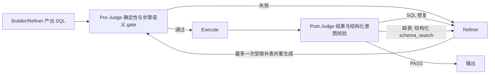

# 阿里 DataAgent NL2SQL 语义校验对比报告

> 调研对象：[`spring-ai-alibaba/DataAgent`](https://github.com/spring-ai-alibaba/DataAgent)  
> 源码快照：`1cc40a21c90f3927a7c534f775da65dcf15f3bdc`，2026-07-29  
> 对比对象：本项目当前的 `Execute -> Judge -> Refiner -> Execute` 闭环  
> 调研日期：2026-08-01

## 1. 结论先行

阿里 DataAgent 的确实现了一个与本项目目标相近的 `SemanticConsistencyNode`：在 SQL 执行前，把“当前执行步骤、SQL、已选 Schema、全局用户问题、Evidence、数据库方言”一起交给 LLM，检查指标、维度、过滤、时间范围、聚合粒度和 JOIN 口径是否一致。

但它不是本项目现在这种严格意义上的“语义往返”：

- 没有把 SQL 回译成自然语言问题；
- 没有计算原问题与回译问题的向量相似度；
- 没有分别输出 `question_intent`、`sql_intent`；
- 没有把指标、维度、过滤条件、时间范围的差异输出为结构化 mismatch；
- 语义节点最终只输出 `passed + reason`。

因此，更准确的表述是：**阿里使用的是“LLM 直接语义审计 + 原 SQL 定向重生成”，本项目使用的是“确定性校验 + 结构化意图对齐 + SQL 回译相似度 + Refiner 受限补 Schema”。两者目标相似，但实现机制和闭环位置不同。**

## 2. 阿里 DataAgent 是怎么做的

### 2.1 它是按执行步骤生成和校验 SQL

DataAgent 先由 Planner 把问题拆成执行步骤。`SqlGenerateNode` 不是直接根据整个用户问题自由生成 SQL，而是读取当前执行步骤的 instruction，再结合：

- 全局用户问题；
- 当前已选 Schema；
- Evidence；
- 数据库方言；
- 前序步骤的真实结果；
- 失败 SQL 和失败原因（重试时）。

这意味着语义校验的主要目标不是一次判断“最终答案是否完整”，而是判断“当前 SQL 是否准确完成当前计划步骤”。这点在多步分析任务中比只对照全局问题更稳。

源码：[`SqlGenerateNode.java`](https://github.com/spring-ai-alibaba/DataAgent/blob/1cc40a21c90f3927a7c534f775da65dcf15f3bdc/data-agent-management/src/main/java/com/alibaba/cloud/ai/dataagent/workflow/node/SqlGenerateNode.java)、[`new-sql-generate.txt`](https://github.com/spring-ai-alibaba/DataAgent/blob/1cc40a21c90f3927a7c534f775da65dcf15f3bdc/data-agent-management/src/main/resources/prompts/new-sql-generate.txt)

### 2.2 SQL 执行前先经过两层校验

第一层是 Java 确定性结构校验。项目使用 Alibaba Druid 解析 SQL，但当前代码只硬性阻断两类问题：

1. SQL 不是恰好一条语句；
2. SQL 中仍有未替换的 `?` 占位符。

解析异常不会在这一层直接失败，而是继续交给后续语义校验或数据库执行错误重试。因此，Prompt 虽然要求只读、表列合法和方言正确，但这些条件并没有全部实现成确定性 AST blocker。

源码：[`SqlUtil.java`](https://github.com/spring-ai-alibaba/DataAgent/blob/1cc40a21c90f3927a7c534f775da65dcf15f3bdc/data-agent-management/src/main/java/com/alibaba/cloud/ai/dataagent/util/SqlUtil.java)

第二层是 `SemanticConsistencyNode` 的 LLM 语义审计。它构造的输入为：

```text
当前执行步骤 + 待验证 SQL + 已选 Schema + 全局用户问题 + Evidence + 方言
```

审计 Prompt 要求依次检查：

- 只读与单语句；
- 表、字段、JOIN 关系和方言；
- 指标、维度、过滤、分组、排序、Top N、输出粒度；
- 时间区间和 DATETIME 结束边界；
- 聚合分母、去重口径、GROUP BY、JOIN 重复计数；
- Evidence 中的明确业务定义。

源码：[`SemanticConsistencyNode.java`](https://github.com/spring-ai-alibaba/DataAgent/blob/1cc40a21c90f3927a7c534f775da65dcf15f3bdc/data-agent-management/src/main/java/com/alibaba/cloud/ai/dataagent/workflow/node/SemanticConsistencyNode.java)、[`semantic-consistency.txt`](https://github.com/spring-ai-alibaba/DataAgent/blob/1cc40a21c90f3927a7c534f775da65dcf15f3bdc/data-agent-management/src/main/resources/prompts/semantic-consistency.txt)

### 2.3 语义节点并不做“SQL -> 自然语言问题”回译

`SemanticConsistencyDTO` 输入虽然很完整，但 `SemanticConsistencyOutputDTO` 只有：

```json
{
  "passed": true,
  "reason": "校验结论或可修复原因"
}
```

也就是说，LLM 在一次调用中直接比较 SQL 与当前步骤，不会显式形成两份结构化意图，更不会再调用 embedding 模型计算相似度。

源码：[`SemanticConsistencyDTO.java`](https://github.com/spring-ai-alibaba/DataAgent/blob/1cc40a21c90f3927a7c534f775da65dcf15f3bdc/data-agent-management/src/main/java/com/alibaba/cloud/ai/dataagent/dto/prompt/SemanticConsistencyDTO.java)、[`SemanticConsistencyOutputDTO.java`](https://github.com/spring-ai-alibaba/DataAgent/blob/1cc40a21c90f3927a7c534f775da65dcf15f3bdc/data-agent-management/src/main/java/com/alibaba/cloud/ai/dataagent/dto/prompt/SemanticConsistencyOutputDTO.java)

### 2.4 失败后回到同一个 SQL 生成节点

语义失败时，节点写入：

```text
SQL_REGENERATE_REASON = SqlRetryDto.semantic(reason)
```

Dispatcher 随后把流程直接送回 `SQL_GENERATE_NODE`。`SqlGenerateNode` 发现已有失败 SQL 和语义失败原因后，会使用 `sql-error-fixer.txt` 做“最小必要修复”，而不是重新从零开始生成。

执行失败也走同一入口，只是 retry 类型变为 `SqlRetryDto.sqlExecute(reason)`。这让 SQL 生成器可以区分“语义失败”和“执行失败”，但二者最终都由同一个生成节点处理。

源码：[`SemanticConsistenceDispatcher.java`](https://github.com/spring-ai-alibaba/DataAgent/blob/1cc40a21c90f3927a7c534f775da65dcf15f3bdc/data-agent-management/src/main/java/com/alibaba/cloud/ai/dataagent/workflow/dispatcher/SemanticConsistenceDispatcher.java)、[`SqlRetryDto.java`](https://github.com/spring-ai-alibaba/DataAgent/blob/1cc40a21c90f3927a7c534f775da65dcf15f3bdc/data-agent-management/src/main/java/com/alibaba/cloud/ai/dataagent/dto/datasource/SqlRetryDto.java)、[`sql-error-fixer.txt`](https://github.com/spring-ai-alibaba/DataAgent/blob/1cc40a21c90f3927a7c534f775da65dcf15f3bdc/data-agent-management/src/main/resources/prompts/sql-error-fixer.txt)

### 2.5 实际运行闭环


这里存在两个受限重试回路：

- `Generate -> SemanticConsistency -> Generate`：执行前语义修复；
- `Generate -> SemanticConsistency -> Execute -> Generate`：执行错误修复。

图的连接关系可见 [`DataAgentConfiguration.java`](https://github.com/spring-ai-alibaba/DataAgent/blob/1cc40a21c90f3927a7c534f775da65dcf15f3bdc/data-agent-management/src/main/java/com/alibaba/cloud/ai/dataagent/config/DataAgentConfiguration.java) 和官方 [`ARCHITECTURE.md`](https://github.com/spring-ai-alibaba/DataAgent/blob/1cc40a21c90f3927a7c534f775da65dcf15f3bdc/docs/ARCHITECTURE.md)。

## 3. 它会不会在语义失败后补表

### 3.1 源码中有补表能力

`Nl2SqlServiceImpl.fineSelect()` 支持接收 `sqlGenerateSchemaMissingAdvice`，再让 LLM 从完整可用 Schema 中选择与缺失实体、字段或关联直接相关的表。`TableRelationNode` 也会读取 `SQL_GENERATE_SCHEMA_MISSING_ADVICE`，存在建议时合并补选结果。

源码：[`Nl2SqlServiceImpl.java`](https://github.com/spring-ai-alibaba/DataAgent/blob/1cc40a21c90f3927a7c534f775da65dcf15f3bdc/data-agent-management/src/main/java/com/alibaba/cloud/ai/dataagent/service/nl2sql/Nl2SqlServiceImpl.java)、[`TableRelationNode.java`](https://github.com/spring-ai-alibaba/DataAgent/blob/1cc40a21c90f3927a7c534f775da65dcf15f3bdc/data-agent-management/src/main/java/com/alibaba/cloud/ai/dataagent/workflow/node/TableRelationNode.java)

### 3.2 但当前语义失败闭环没有连到这个能力

在本次调研的主分支快照中：

- `SemanticConsistencyNode` 只写 `SQL_REGENERATE_REASON`，不写 `SQL_GENERATE_SCHEMA_MISSING_ADVICE`；
- 语义失败边直接回 `SqlGenerateNode`，不回 `TableRelationNode`；
- `SQL_GENERATE_SCHEMA_MISSING_ADVICE` 在生产代码中只有常量注册和读取位置，没有发现写入者；
- 重生成继续使用原来的 `TABLE_RELATION_OUTPUT`。

所以当前实际行为是：**语义节点可以说“缺某张表/字段”，SQL fixer 能看到这段 reason，但运行链路不会因此自动重新执行表选择。** 补表代码更像一个尚未接入当前语义重试图的扩展钩子，而不是已经闭合的 recovery loop。

这与本项目现在明确放在 Refiner 内部的一次受限 schema retrieval 有本质区别。

## 4. 与本项目逐项对比

| 对比项 | 阿里 DataAgent | 本项目当前实现 |
|---|---|---|
| 校验位置 | SQL 执行前 | SQL 执行后，每轮 Execute 后必经 Judge |
| 校验粒度 | 当前 Planner 执行步骤 | 原问题为主，可带 plan、schema、采样和执行结果 |
| 确定性检查 | Druid：一条语句、无 `?`；其余多交给 Prompt | sqlglot：语法/只读、表列权限、执行状态、结果 schema、聚合口径 |
| 语义方法 | LLM 直接比较步骤、问题、SQL、Schema、Evidence | LLM 结构化意图比较 + SQL 回译问题 + MiniLM 相似度 |
| 语义输出 | `passed + reason` | `question_intent/sql_intent/mismatches` + 评分 + structured feedback |
| 是否利用执行结果 | 语义审计不利用；执行失败单独重试 | Judge 同时读取执行状态、结果列和样例结果 |
| 修复执行者 | 同一个 `SqlGenerateNode`/SQL fixer | 独立 Refiner |
| 反馈类型 | `semanticFail` 或 `sqlExecuteFail` + reason | 版本化 issues、category、severity、schema_search、regeneration contract |
| 缺表恢复 | 有补选接口，但当前语义失败图未接通 | Judge 提需求，Refiner 最多一次、最多补两表，不重启前置 pipeline |
| 成功出口 | 语义通过后执行；执行成功推进计划 | Judge 是唯一 PASS 出口 |
| 主要风险 | 可执行但结果错误时，执行后没有结果级语义复核 | 调用次数、延迟和语义回译/相似度噪声更高 |

## 5. 对本项目的直接启示

### 建议保留的设计

1. 保留 `Execute -> Judge -> Refiner -> Execute` 主循环。它能检查真实执行状态和结果 schema，覆盖阿里执行前语义节点看不到的“SQL 可执行但答案错误”。
2. 保留结构化 `intent_comparison`。它比单个 reason 更容易驱动 Refiner，也更适合 trace、测试和错误归因。
3. 保留 Refiner 所有的一次受限补表。不要把循环重新拉回初始 SchemaLinker、DataSampler、RAG、Planner 和 Builder。
4. 保留确定性 blocker 高于相似度分数的规则，避免“自然语言相似但 SQL 结构或权限错误”被误放行。

### 值得借鉴的设计

1. **引入 `current_execution_step`。** Judge 除了全局问题，还应明确知道本轮 SQL 负责哪个计划步骤，避免把“没有解决整个问题”误判为当前 SQL 错误。
2. **增加轻量执行前 gate。** 在 Execute 前做只读、单语句、占位符、明显表列越权和步骤语义检查，减少无效或危险 SQL 进入数据库；执行后 Judge 仍作为最终出口。
3. **使用 typed retry envelope。** 明确区分 `semantic_fail`、`execution_fail`、`schema_missing`、`result_contract_fail`，Refiner 可以按类型选择修复提示和预算。
4. **修复 Prompt 强调最小修改。** 把失败 SQL、具体原因和当前步骤交给 Refiner，要求保留正确的过滤、聚合和排序，减少每轮重写导致的语义漂移。
5. **分开统计重试预算。** SQL 生成失败、语义失败、执行失败、补 schema 可各有独立计数，trace 会比一个总迭代数更容易定位瓶颈。

## 6. 推荐的融合形态



这个融合方案不是把本项目改成阿里的流程，而是吸收它“按执行步骤校验、执行前拦截、typed retry、最小修复”的优点，同时保留本项目更强的执行后 Judge、结构化意图差异和 Refiner-owned 受限补 Schema。

## 7. 调研边界

- 已核对 GitHub 当前主分支及上述节点、Dispatcher、Prompt、DTO、图配置和表选择服务源码。
- “补表钩子当前未接入语义失败闭环”是根据该源码快照中状态键的读写位置和图边得出的静态结论。
- 本次没有部署阿里 DataAgent，也没有用真实模型和数据库做运行时 trace；模型实际审计质量、延迟和错误分布仍需实测。
- 本项目对比基于当前工作区代码；工作区存在未提交修改，因此报告描述的是当前文件状态，不等同于某个 Git commit。
