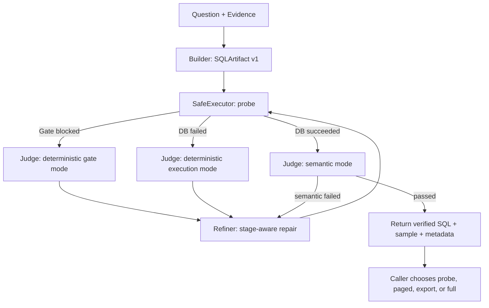

# NL2SQL SafeExecutor、Judge 与 Refiner 闭环实施方案

## 1. 文档状态

- 目标：把已确认的设计结论整理为可直接执行的文件级改造方案。
- 范围：Builder、SafeExecutor、Judge、Refiner、Orchestrator、benchmark 及相关测试。
- 当前阶段：v10 首期实现已落地，核心单元测试与闭环路由测试通过。
- 首期数据库方言：SQLite。
- 首期仍保留单 SQL，不引入真正的多步骤 SQL Planner。

## 2. 核心结论

系统不再把“执行 SQL”理解为一次无条件数据库调用，而是统一经过 `SafeExecutor`：

1. 每个新生成或重新生成的 SQL 都先经过确定性的 `PreExecutionGate`。
2. Gate 只判断 SQL 是否安全、结构是否完整、是否值得提交给数据库，不判断业务语义是否正确。
3. Gate 通过后，`DatabaseExecutor` 才能以数据库只读模式执行。
4. Gate 失败或数据库执行失败时，Judge 只做确定性反馈归一化，不调用 Judge LLM。
5. 只有 Gate 通过且数据库执行成功后，Judge 才做语义往返和结构化意图比对。
6. Refiner 针对 `gate`、`database`、`semantic` 三类失败使用不同修复上下文；修复后的 SQL 必须重新经过完整 SafeExecutor。
7. 只有语义失败扣减语义重试预算；Gate 修复和执行错误修复使用各自预算，同时受总 SQL 尝试数约束。
8. Builder/Refiner 输出的 `DraftIntent` 是可被 Judge 质疑和修订的生成假设，不是不可修改的真值。原问题和 Evidence 才是根约束。

## 3. 目标运行链路



这里没有从 Refiner 回到初始 SchemaLinker。语义修复确实需要补表时，由 Refiner 发起一次受限 schema recovery，并把补充结果带回当前循环。它不重跑 DataSampler，也不重启整条 pipeline。

第一次生成结果只形成初始 `DraftIntent v1`。后续模块可以通过三方比对发现它本身理解错误，Refiner 可以生成 `DraftIntent v2`，但必须记录修订原因，不能静默覆盖。

## 4. Gate 的严格边界

### 4.1 阻断项

| 检查 | 处理 | 典型反馈码 |
|---|---|---|
| UPDATE、DELETE、INSERT、DDL 等非只读语句 | 阻断，不访问数据库 | `safety.non_read_only` |
| 多 SQL statement | 阻断 | `structure.multiple_statements` |
| 在指定 dialect 下无法可靠解析 | 阻断 | `syntax.parse_error` |
| 未解析模板占位符 | 阻断 | `structure.unresolved_placeholder` |
| 引用了完整授权 Schema 中不存在的表 | 阻断 | `schema.table_not_authorized` |
| 引用了完整授权 Schema 中不存在的列 | 阻断 | `schema.column_not_authorized` |
| 方言未配置或当前实现不支持 | 配置错误，终止当前请求 | `config.unsupported_dialect` |

`full_authorized_schema` 是权限边界。Gate 不得因为模型“可能知道这个表”而放行，也不得通过补充检索扩大授权边界。

### 4.2 非阻断项

以下信息可以由 AST 稳定提取，但带有业务语义解释空间，因此只进入 `sql_signature` 或 warnings：

- 聚合函数、聚合列和 `GROUP BY`。
- join 类型和 join key。
- 过滤条件、时间谓词和时间粒度。
- 排序、Top-N、LIMIT。
- 投影列、DISTINCT、窗口函数。
- 使用了授权范围内、但不在本次 `relevant_schema` 中的表。

其中最后一种情况输出 `schema.outside_retrieval` 警告，但仍可执行。聚合口径、结果粒度是否符合问题，属于 Judge 语义阶段，不应被 Gate 阻断。

### 4.3 Dialect 规则

- 方言从 Orchestrator 显式传入 Builder、Gate、Judge 和 Refiner。
- 首期默认值为 `sqlite`，但默认值只在调用端未覆盖时生效。
- 禁止自动猜测方言，禁止解析失败后静默换方言重试。
- 不支持的方言是配置错误，不进入 Refiner 循环，也不消耗任何修复预算。

## 5. 核心数据合同

建议新增 `agent_team/contracts.py`，使用 dataclass 或 TypedDict 固定跨模块字段，避免继续传递含义不稳定的散装 dict。

### 5.1 SQLArtifact

Builder 和 Refiner 都返回同一结构：

```json
{
  "sql": "SELECT ...",
  "draft_intent": {
    "metrics": [],
    "dimensions": [],
    "filters": [],
    "time_range": {},
    "output_grain": "",
    "required_concepts": []
  },
  "intent_version": 1,
  "intent_revision": null,
  "generation_warnings": [],
  "raw_response": "..."
}
```

约束：

- `draft_intent` 缺失或格式错误时，记录 `generation.contract_missing`，但只要能可靠提取 SQL，仍继续进入 Gate。
- SQL 也无法提取时，记为生成失败，进入受总次数约束的修复流程。
- Refiner 修改 DraftIntent 时，`intent_version + 1`，并填写 `intent_revision.reason`。
- 为兼容现有调用方，可先新增 `build_artifact()`，暂时保留 `build()` 返回 SQL 字符串。

### 5.2 GateResult

```json
{
  "passed": false,
  "dialect": "sqlite",
  "blockers": [
    {
      "code": "schema.column_not_authorized",
      "message": "Column is absent from the authorized schema",
      "details": {"table": "orders", "column": "profit"}
    }
  ],
  "warnings": [],
  "sql_signature": {
    "statement_type": "select",
    "tables": ["orders"],
    "projected_columns": [],
    "aggregations": [],
    "group_by": [],
    "joins": [],
    "filters": [],
    "order_by": [],
    "limit": null
  }
}
```

### 5.3 ExecutionAttempt

无论失败发生在哪一层，SafeExecutor 都返回同一外壳：

```json
{
  "stage": "gate",
  "attempted": false,
  "ok": false,
  "mode": "probe",
  "gate": {},
  "columns": [],
  "sample_rows": [],
  "truncated": false,
  "row_count": null,
  "row_count_exact": false,
  "execution_ms": null,
  "result_profile": null,
  "error": null
}
```

`stage` 取值为 `gate` 或 `database`。Gate 失败时 `attempted=false`，这可以让 Judge、日志和 benchmark 明确区分“未执行”与“执行后报错”。

### 5.4 执行模式

| mode | 首期状态 | 行为 |
|---|---|---|
| `probe` | 实现 | 游标读取 N+1 行，仅返回 N 行样本，并设置 `truncated` |
| `full` | 实现 | 仅供 benchmark 最终 pred/gold 对比或明确要求的调用端使用 |
| `paged` | 预留 | 未实现时明确报 `execution.mode_not_supported` |
| `export` | 预留 | 未实现时明确报 `execution.mode_not_supported` |

Probe 不改写 SQL 添加 LIMIT，也不额外执行 COUNT、DISTINCT 或统计查询。`result_profile` 只基于样本计算列数、样本空值数和样本值类型。只要结果被截断，`row_count_exact=false`，任何模块都不得据此作精确行数判断。

### 5.5 JudgeResult 模式

| 输入状态 | Judge mode | Judge LLM | 输出重点 |
|---|---|---|---|
| Gate 失败 | `gate` | 0 次 | 归一化 blockers、修复建议、failure fingerprint |
| DB 执行失败 | `database` | 0 次 | 错误分类、修复建议、failure fingerprint |
| DB 执行成功 | `semantic` | 按既有语义策略 | 原问题、DraftIntent、SQLIntent 三方比对 |

`semantic.intent_contract_missing` 只允许出现在 semantic 模式，不能在 Gate 预检阶段凭空产生。

### 5.6 RetryState

建议默认值：

```python
MAX_GATE_REPAIRS = 2
MAX_EXECUTION_REPAIRS = 2
MAX_SEMANTIC_REPAIRS = 5
MAX_TOTAL_SQL_ATTEMPTS = 10
MAX_RESCHEMA_ITERATIONS = 1
MAX_RESCHEMA_TABLES = 2
```

计数规则：

- 每产生一个新的 SQL，`total_sql_attempts += 1`。
- 只有 semantic 模式失败才增加 `semantic_repairs`。
- Gate 与数据库错误分别增加自己的计数，不影响语义预算。
- 同一个 SQL 再次出现，立即停止，错误码 `repair.duplicate_sql`。
- 同类归一化 failure fingerprint 连续出现两次，停止无效循环。
- Judge LLM score 只保留在 trace 中，不再作为提前终止条件。
- `judge_history` 只记录真正进入 semantic 模式的结果。

## 6. Judge 的三方语义比对

语义阶段不把 Builder 的意图声明当作答案，而是独立比较：

1. `DraftIntent` 与原问题：生成阶段是否理解错了指标、维度、过滤条件或时间范围。
2. `SQLIntent` 与原问题：SQL/执行计划回译出的实际意图是否回答原问题。
3. `SQLIntent` 与 `DraftIntent`：SQL 是否正确实现了生成器自己声明的方案。

典型诊断：

| 情况 | 诊断 |
|---|---|
| DraftIntent 对，SQLIntent 错 | `sql_implementation_issue` |
| DraftIntent 错，SQLIntent 与它一致 | `contract_issue` |
| DraftIntent 错，SQLIntent 却更接近问题 | `contract_drift`，允许保留 SQL 并修订 Intent |
| 两者都错且方向不同 | 同时输出 contract 与 SQL mismatch |

结构化反馈至少覆盖 `metrics`、`dimensions`、`filters`、`time_range`、`aggregation_grain`、`required_concepts`，并保留可定位到 AST/执行样本的 evidence。Refiner 应优先消费这些字段，而不是依赖自然语言总评。

## 7. Refiner 路由与受限补 Schema

建议统一公开入口：

```python
repair(
    artifact,
    failure_stage="gate" | "database" | "semantic",
    feedback=structured_feedback,
    context=repair_context,
) -> SQLArtifact
```

内部策略：

- `gate`：只修安全、语法、占位符和已授权 schema 引用问题。
- `database`：结合数据库错误修复运行时问题。
- `semantic`：结合三方比对结果修复指标、维度、过滤、时间和聚合口径。

受限 schema recovery 仍归 Refiner 所有：

- 只允许 semantic 或可证明的 schema 缺口触发。
- 未授权表绝不能成为补检索候选。
- 每条请求最多一次，最多补两张表。
- 只扩充当前修复上下文，不回到初始 SchemaLinker，不重跑 DataSampler。
- 补充后生成的新 SQL 仍重新经过 Gate。

## 8. 文件级改造地图

### 8.1 新增文件

| 文件 | 职责 |
|---|---|
| `agent_team/contracts.py` | `SQLArtifact`、`DraftIntent`、`GateResult`、`ExecutionAttempt`、`RetryState` 等共享合同 |
| `agent_team/pre_execution_gate.py` | 基于 sqlglot 的单语句、只读、占位符、表列授权检查及 `sql_signature` 提取 |
| `agent_team/executor.py` | `DatabaseExecutor`、`SQLiteReadOnlyExecutor`、`CallbackExecutorAdapter`、`SafeExecutor` |
| `tests/test_pre_execution_gate.py` | Gate 阻断边界和非阻断信息测试 |
| `tests/test_safe_executor.py` | 只读连接、probe/full、无数据库调用等测试 |
| `tests/test_retry_routing.py` | 三类预算、重复 SQL、fingerprint、每次重过 Gate 测试 |
| `tests/test_sql_artifact.py` | DraftIntent JSON、SQL fallback、版本修订测试 |

### 8.2 修改文件

| 文件 | 主要修改 |
|---|---|
| `agent_team/nl2sql_judge.py` | 将 pre-exec AST 检查迁出；DB 成功前不调用 LLM；保留结果 schema 检查和三方语义比对 |
| `agent_team/orchestrator.py` | 接入 SafeExecutor；显式状态机；拆分重试预算；删除 score 趋势硬终止；修正无 executor 状态 |
| `agent_team/builder.py` | 增加 `build_artifact()`；解析结构化 DraftIntent + SQL；传入 dialect；保留兼容入口 |
| `agent_team/refiner.py` | 合并为 stage-aware repair；使用对应失败上下文；输出版本化 SQLArtifact |
| `agent_team/prompts/builder_prompt_generic.txt` | 从“只输出 SQL”改为稳定 JSON 合同，并要求 DraftIntent |
| `agent_team/prompts/refiner_prompt_generic.txt` | 按 failure stage 描述事实，删除一律“SQL 已执行”的假设 |
| `agent_team/prompts/judge_prompt_generic.txt` | 增加三方比对与结构化 mismatch；强调 DraftIntent 可被否定 |
| `benchmark.py` | 修复循环使用 `probe`；最终 pred/gold 使用 `full`；移除 writable `fetchall()` 执行入口 |
| `README.md` | 更新架构、执行模式、安全声明、无 executor 返回语义和兼容限制 |
| `tests/test_judge_closed_loop.py` | 更新聚合粒度预期；增加 semantic/preflight 模式边界 |

现有 `nl2sql_judge._verify_sqlglot()` 同时混合了解析授权、执行状态和结果 schema 检查。迁移时应拆成 pre-exec Gate 与 post-exec Judge 两部分，避免简单复制后出现两套规则。

## 9. 分阶段实施

### Phase 0：行为固化

1. 为当前关键行为补 characterization tests。
2. 用 spy 固化当前 Builder、Executor、Judge、Refiner 的调用顺序。
3. 记录现有公开返回字段，确定兼容窗口。
4. 明确 sqlglot 为运行时依赖；仓库没有统一依赖清单时，在本阶段补最小依赖声明。

验收：未改业务逻辑前，新增测试能准确暴露当前“Judge 提前调用 LLM”“无 executor 却 success=true”等行为。

### Phase 1：Gate 与只读执行

1. 新增共享合同和 `PreExecutionGate`。
2. 从 Judge 提取纯 AST 检查，并把聚合类检查降为 signature/warning。
3. 实现 `SQLiteReadOnlyExecutor`：
   - 使用 `file:{db_path}?mode=ro` 与 `uri=True`。
   - 连接后执行 `PRAGMA query_only=ON`。
   - 设置超时并在 `finally` 中关闭连接。
4. 实现 `SafeExecutor.execute(artifact, mode="probe")`。
5. 原始 callback 仅通过 `CallbackExecutorAdapter` 兼容，文档明确它不能证明数据库只读。

验收：所有危险 SQL 在数据库调用前被阻断；即使绕过 Gate 直接调用 SQLite executor，写操作仍被数据库只读机制拒绝。

### Phase 2：状态机与重试预算

1. Orchestrator 改用 `ExecutionAttempt` 驱动路由。
2. Judge 增加 gate/database/semantic 三种显式模式。
3. Gate 和 DB 失败路径确保 Judge LLM 调用次数为 0。
4. Refiner 接入 stage-aware repair。
5. 拆分三类预算并增加总尝试、重复 SQL、failure fingerprint 终止条件。
6. 每个 Refiner 新 SQL 强制重新进入 SafeExecutor。

验收：初始 SQL 的 Gate 结果不会赋予后续 SQL任何通行资格；重生成 SQL 若变成危险语句会被新的 Gate 结果阻断。

### Phase 3：DraftIntent 与三方语义判断

1. Builder/Refiner 输出 `SQLArtifact`。
2. 增加严格 JSON 解析和纯 SQL fallback。
3. Judge 对原问题、DraftIntent、SQLIntent 做三方比对。
4. Refiner 支持版本化 Intent 修订并记录原因。
5. `generation.contract_missing` 保持非阻断；SQL 缺失才按生成失败处理。

验收：即便 Builder 的 DraftIntent 与 SQL 完全一致，只要二者共同偏离原问题，Judge 仍能输出 `contract_issue` 并触发修复。

### Phase 4：调用端、benchmark 与文档迁移

1. benchmark 修复循环使用 probe，最终结果比较使用 full。
2. Agent 主流程 Judge PASS 后不自动 full 重跑。
3. 无 executor 时返回：
   - `status="generated_unverified"`
   - `success=false`
   - `sql_generated=true`
   - `gate_passed=null`
   - `execution_attempted=false`
   - `judge_passed=null`
4. 为调用端保留 paged/export 接口，未实现时明确报错。
5. 更新 README 和外部学习文档中的流程图、字段及安全边界。

验收：benchmark 仍能做完整结果等价比较；普通 Agent 调用不会为了展示样本而无条件加载全量结果。

## 10. 测试矩阵

### Gate

- SELECT/CTE/UNION 的只读单语句通过。
- UPDATE、DELETE、INSERT、CREATE、DROP、ALTER 阻断且数据库 spy 调用为 0。
- `SELECT ...; DELETE ...` 按多语句阻断。
- 指定 SQLite 方言解析失败时阻断，不尝试其他方言。
- 表或列不在 `full_authorized_schema` 时阻断。
- 表在完整授权 schema、但不在 `relevant_schema` 时仅 warning，仍调用数据库。
- 聚合、GROUP BY、时间过滤、Top-N 只进入 signature，不因语义猜测阻断。
- 占位符未解析时阻断。

### Executor

- SQLite 连接使用 URI read-only 和 `query_only`。
- 直接执行写 SQL 被数据库拒绝。
- probe 读取 N+1，返回 N 行并正确设置 `truncated`。
- 未截断时行数可以标记 exact；截断时必须为 false。
- result profile 只反映样本，不伪装为全表统计。
- full 返回完整数据，供 benchmark 使用。
- paged/export 首期返回明确 unsupported 错误。

### Judge 与 Refiner

- Gate 失败：Judge LLM 0 次，Refiner 收到 `failure_stage=gate`。
- DB 失败：Judge LLM 0 次，Refiner 收到数据库错误及已通过的 Gate signature。
- DB 成功：才调用语义评分与 SQL 意图回译。
- semantic 模式下缺少 DraftIntent 可报告 contract warning；Gate 模式不得生成该问题。
- 受限 schema recovery 最多一次、最多两表，且不接受未授权表。
- Refiner 每次返回的新 SQL 都触发一次新的 Gate 调用。

### 重试与返回语义

- Gate/DB 失败不扣 semantic budget。
- semantic 失败只扣 semantic budget，同时增加总尝试次数。
- 重复 SQL 立即停止。
- 同一 failure fingerprint 连续两次停止。
- score 上升或下降都不直接决定是否继续。
- 无 executor 时 `success=false` 且状态为 `generated_unverified`。
- 只有 Judge semantic PASS 才能返回 `success=true`。

### DraftIntent

- 合法 JSON 正确生成 SQLArtifact。
- JSON 破损但含可靠 SQL 时 fallback 成功并给 warning。
- SQL 无法提取时进入生成失败。
- Intent 修订必须递增版本并保留 reason。
- “错误 DraftIntent + 与其一致的 SQL”能被原问题反制。

## 11. 可观测性与 Trace

每次 SQL 尝试至少记录：

- `attempt_id`、`parent_attempt_id`、`sql_hash`、`intent_version`。
- `failure_stage`、Gate blockers/warnings、数据库错误分类。
- `execution_mode`、`execution_ms`、`truncated`、`row_count_exact`。
- 各类预算使用量和剩余量。
- Refiner 使用的反馈码、是否触发 schema recovery、补充了哪些表。
- semantic 模式的结构化 mismatch 和 LLM score；score 仅用于观察。

不要把完整敏感数据行、数据库凭据或未脱敏模型上下文写入普通日志。样本记录应支持调用端关闭或脱敏。

## 12. 风险与控制

| 风险 | 控制措施 |
|---|---|
| sqlglot 对复杂 CTE、别名、相关子查询的列解析误判 | 建立复杂查询回归集；只对高确定性不存在项阻断，无法确定时给 warning |
| Gate 被继续添加语义规则而膨胀 | 新规则必须回答“能否确定它不安全或不可执行”；否则放 Judge |
| callback 兼容层让调用方误以为具备只读安全 | 返回能力标记并在 README 明示；benchmark 优先迁移到标准 executor |
| probe 样本诱发错误的全量结论 | 强制传播 `truncated` 和 `row_count_exact`，Judge prompt 禁止从样本推导精确基数 |
| DraftIntent 变成另一份不可质疑的真值 | 三方比对以原问题和 Evidence 为根；支持版本化修订 |
| 预算拆分后出现更长死循环 | 总尝试上限、重复 SQL 和 failure fingerprint 三重终止 |
| benchmark 因 probe 改造失去准确结果比较 | 修复阶段 probe，最终 pred/gold 显式 full |

## 13. 非目标

- Gate 不检查业务指标是否正确，不判断 join 是否“符合业务常识”。
- 首期不实现查询成本优化器，不依赖 EXPLAIN 决定语义正确性。
- 首期不实现 paged/export 的具体数据库行为。
- 首期不支持 SQLite 之外的标准 DatabaseExecutor。
- 不把单 SQL 改成多 SQL 工作流。
- 不从 Refiner 回到 SchemaLinker 起点，不重跑 DataSampler。
- 不用 Judge LLM 修复明确的语法、权限或数据库执行问题。

## 14. Definition of Done

只有同时满足以下条件，才视为本轮改造完成：

1. 所有生成和重生成 SQL 都通过同一个 SafeExecutor 入口。
2. Gate 阻断边界、授权 Schema 和 dialect 行为有单测覆盖。
3. SQLite 执行器具备数据库层只读保护，probe/full 语义明确。
4. Gate/DB 失败前 Judge LLM 调用数为 0。
5. 三类重试预算独立，且总尝试、重复 SQL、fingerprint 能终止循环。
6. DraftIntent 可缺失、可质疑、可版本化修订，不会绑架最终判断。
7. Judge 能基于原问题反制“SQL 与错误 DraftIntent 完全一致”的情况。
8. benchmark 最终结果仍使用 full 模式比较，普通链路不自动全量执行。
9. 无 executor 不再被标记为成功。
10. 全量测试通过，README 与学习文档同步到新链路。

建议验证命令：

```bash
python3 -m pytest tests/test_pre_execution_gate.py
python3 -m pytest tests/test_safe_executor.py
python3 -m pytest tests/test_retry_routing.py
python3 -m pytest tests/test_sql_artifact.py
python3 -m pytest tests/test_judge_closed_loop.py tests/test_rag_upgrade.py
python3 -m pytest tests
```

小规模 benchmark 需要有效数据库、数据集和模型配置，应作为集成验收单独执行，不能用单测通过替代。

## 15. 当前核验边界

已落地并核验：Orchestrator 使用 SafeExecutor 状态机和独立预算；Judge 在 Gate/DB 失败时零 LLM 短路；Builder/Refiner 支持 SQLArtifact 与 DraftIntent fallback；benchmark 修复循环使用 probe、最终比较使用 full；SQLite 写操作在数据库只读层被拒绝；聚合检查已降为非阻断 observation。

自动验证：WSL 隔离依赖环境下执行 `python3 -m pytest tests -q`，25 项测试通过；`compileall` 通过。尚未执行需要真实模型密钥和 BIRD 数据集的小规模 benchmark，因此端到端模型效果与性能仍属于未验证边界。
